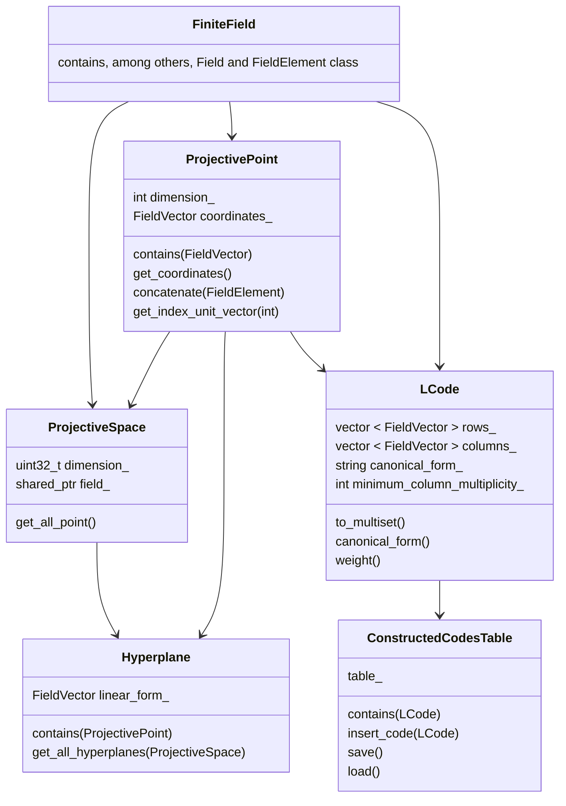

<div align="center">

<!-- A logo would be welcome
 
-->

# LinCode - Linear Code Classification Tool

<!-- Some random (not exactly) badges


-->

</div>

The goal of the LinCode software is to classify linear codes.
The implemented algorithms are exposed in [1] and [2].

For inquiries about the tool contact nowar.kazem@ens-rennes.fr.


## Installation 

### 1. Clone This Repository 

First, clone this project:

```bash
git clone https://github.com/NowarKa/LinCode.git
```

### 2. Build This Project 

To build this project you will need:

- C++20 compiler.
- CMake >= 3.15.
- Sage binary.
- Solvediophant binary.

From the root directory of this project:

```bash
cmake CMakeLists.txt
make
```

This will produce the `LinCode` executable.


## Running

 
Running the following command:

```bash
./LinCode --help
```
produces

```bash
LinCode - Linear Code Classification Tool
Usage: ./LinCode [OPTIONS]

Options:
  -h,--help                   Print this help message and exit
  --delta INT                 Restrict to linear codes whose weights are divisible by delta (default: 1).
  -q,--field-order [0]        Order of the finite field (default: 2).
  -d,--minimum-weight [0]     Minimum minimum distance of the linear codes to classify.
  --check-feasibility         Check the feasibility of solutions with SCIP before enumerating them.
  --save-results              Save the classified codes to disk.
```
The generated files are placed in the `output` folder. 
SVG files illustrating all intermediate availability relations (AVs) are 
stored in the `output/AVs` folder. Note that the generation of the .svg files
for all intermediate availability relations increases substantially the execution time. 

To clean and delete the generated files, run the following command 
(which requires the `Makefile` to be present, which can be done by 
running the command ```cmake CMakeLists.txt```):

```bash
make output_clean
```


## Code structure



## License

This project is licensed under the GNU General Public License v3.0 
(GPL-3.0). See the `LICENSE` file for details.

## References

[1] Kurz, S. (2024). Computer Classification of Linear Codes Based on Lattice 
Point Enumeration. In: Mathematical Software – ICMS 2024. ICMS 2024. Lecture 
Notes in Computer Science, vol 14749. Springer, Cham. 
https://doi.org/10.1007/978-3-031-64529-7_11

[2] I. Bouyukliev, S. Bouyuklieva and S. Kurz, "Computer Classification of 
Linear Codes," in IEEE Transactions on Information Theory, vol. 67, no. 12, 
pp. 7807-7814, Dec. 2021, doi: 10.1109/TIT.2021.3114280.


<!--  ## Roadmap
Will be there soon. -->

<!-- This README is inspired by the default README and the one of GSS -->

